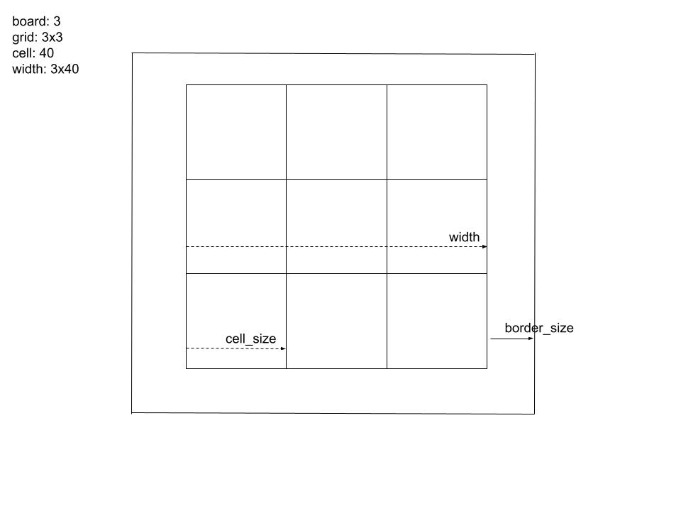

# Sanke Game

# Window design

* game window
* grid: we use a (n x n) square, default 12.
* board: 12, so grid = board * board = 12 * 12 = 144
* cell: one square, 40 px height, 40 px width
* width (grid width): board x cell = 12x40
* height (grid height): board x cell = 12x40
* border_size = 20

* display_width = width + 2 * border_size =  520
* display_height = display_width + 40 = 560

* In summary: game uses a height 560 x width 520, there is grid 480x480 in it. In the grid, 12 x 12 cells. Each cell is 40px height, 40px width.

# Game design
